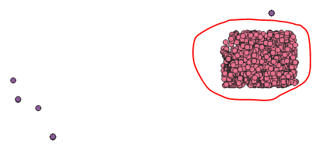

# oracle-sde-to-qgis

Messy notes for getting data from Oracle with SDE geometries into QGIS (on Windows).

You have an Oracle database. It stores geometries in ArcSDE format. You want to read the tables in QGIS. You may or may not be running Windows. These notes may be helpful to you.

## Step 0 - make sure you have Oracle libraries installed

Check bit-ness of QGIS Python. From QGIS Python console:

```python
>>> import struct
>>> struct.calcsize("P")
8
```

8 means 64-bit. Make sure you have 64-bit Oracle client libraries installed. I didn't, so:

1. Register account with Oracle.
2. Download the ZIP installer https://www.oracle.com/database/technologies/instant-client/winx64-64-downloads.html
3. Unzip
4. Add the folder with all the DLLs to your PATH via Windows.

## Step 1. Install cx_Oracle into your QGIS Python

Find your QGIS Python location. In QGIS Python console:

```python
>>> import struct
struct
<module 'struct' from 'C:\\PROGRA~1\\QGIS3~1.4\\apps\\Python37\\lib\\struct.py'>
```

Then in command prompt:

```
> C:\\PROGRA~1\\QGIS3~1.4\\apps\\Python37\python -m pip install cx_Oracle
```

## Step 2. Proof of concept script

Run this in QGIS Python console:

```python
from qgis.core import *

import cx_Oracle

HOST = "..."
DB = "..."
USER = "..."
PWD = "..."

db = cx_Oracle.Connection(dsn="{host}:{port}/{db}".format(host=HOST, port=1521, db=DB, user=USER, password=PWD)

def create_feature_from_row(row):
    dhno, wkt = iter(row)
    wkt = wkt.read()
    feature = QgsFeature()
    geometry = QgsGeometry.fromWkt(wkt)
    feature.setGeometry(geometry)
    #print((dhno, wkt, geometry, feature))
    return feature

def create_layer(table, where="where rownum < 10"):
    cursor = db.cursor()
    result = cursor.execute("select dhno, sde.st_astext(shape) from {} {}".format(table, where))
    layer = QgsVectorLayer("Point?crs=epsg:3107", table, "memory")
    layer.startEditing()
    layer_data = layer.dataProvider()
    layer_fields = layer.dataProvider().fields().toList()
    attr = layer.dataProvider().fields().toList()
    layer_data.addAttributes(attr)
    layer.updateFields()
    for row in result:
        feature = create_feature_from_row(row)
        layer.addFeature(feature)
    layer.updateExtents()
    layer.commitChanges()
    return layer
    
layer = create_layer("water.drillholes", "where name like '%TWS%'")
QgsProject.instance().addMapLayer(layer)
```

Note the SQL function ``sde.st_astext(shape)`` which converts the ST_GEOMETRY object in the `shape` column to a Well-Known Text (WKT) format. Maybe see [here](http://desktop.arcgis.com/en/arcmap/10.3/manage-data/using-sql-with-gdbs/st-astext.htm)?

I haven't pulled any attributes, just focusing on the geometry here. You need to know the CRS yourself - I figured out manually that the database in question is using EPSG 3107.

## Spatial queries woop woop

```sql
SELECT dhno, 
       sde.St_astext(shape) 
FROM   water.drillholes 
WHERE  sde.St_contains (sde.St_polygon ( 
'polygon ((1252701 1897185, 1364200 1897185, 1364200 1977889, 1252701 1977889, 1252701 1897185))' 
, 3107), shape) = 1  
```

